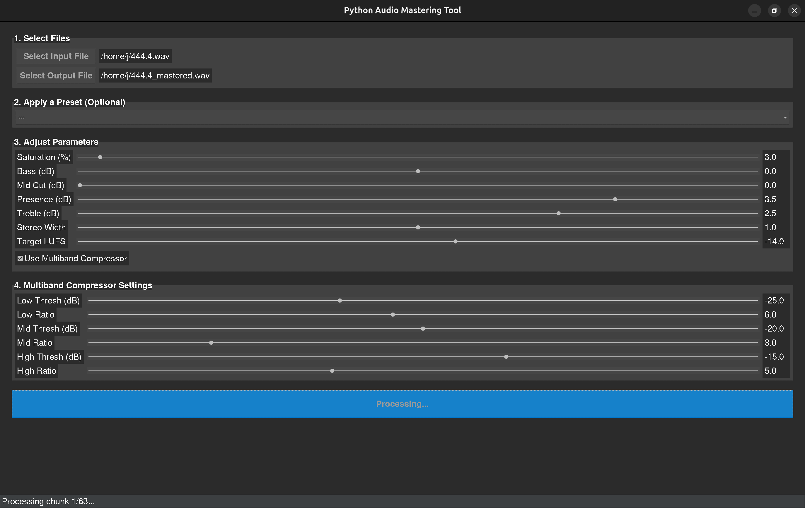

# Python Audio Mastering GUI

A user-friendly desktop application for mastering your audio files. Built with Python, this tool provides a complete mastering chain—including a harmonic exciter, detailed multiband compression, equalization, stereo widening, and LUFS loudness normalization—all wrapped in an intuitive graphical user interface.



---

## Features

-   **Intuitive Graphical Interface:** No command line needed. Easily load files, adjust parameters with sliders, and process your audio with the click of a button.
-   **Professional Mastering Chain:**
    -   **Harmonic Exciter:** Add analog warmth, character, and sparkle to your mix with a dedicated saturation control.
    -   **Detailed Multiband Compressor:** Tame dynamics with surgical precision using independent threshold and ratio controls for the low, mid, and high frequency bands.
    -   **Stereo Widener:** Widen your mix for a more immersive, professional soundstage.
    -   **4-Band EQ:** Shape your sound with controls for Bass, Mids, Presence, and Treble.
    -   **Genre Presets:** Instantly apply EQ curves tailored for Techno, Pop, Dubstep, and Rock.
-   **LUFS Loudness Normalization:** Target professional, streaming-ready loudness levels (e.g., -14 LUFS for Spotify) for consistent volume without digital clipping.
-   **Robust & Efficient:** Handles audio files of any size without running out of memory by processing them in manageable chunks with a progress bar.

---

## Installation & Setup

This application requires a specific Python environment to ensure all libraries work correctly. Please follow these steps.

### 1. Create a Conda Environment

This project requires **Python 3.11**. The best way to manage this is with Conda.

```bash
# Create a new environment named "audio_env" with Python 3.11
conda create -n audio_env python=3.11
```

### 2. Activate the Environment

You must activate this environment every time you want to run the application.

```bash
conda activate audio_env
```
*(Your terminal prompt will change to show `(audio_env)`)*

### 3. Install Required Libraries

Once the environment is active, install all necessary Python packages with this single command:

```bash
pip install pydub scipy numpy pyloudnorm tqdm ttkthemes
```

### 4. Install FFmpeg

The audio engine requires FFmpeg for handling different audio formats.
-   **On Debian/Ubuntu:**
    ```bash
    sudo apt update && sudo apt install ffmpeg
    ```
-   **On macOS (using Homebrew):**
    ```bash
    brew install ffmpeg
    ```

---

## How to Run

After completing the setup, you can launch the application.

1.  Open your terminal.
2.  Navigate to the project directory: `cd /path/to/Python-Audio-Mastering`
3.  Activate the Conda environment: `conda activate audio_env`
4.  Run the GUI script:
    ```bash
    python mastering_gui.py
    ```

## How to Use the GUI

The workflow is simple and is broken into sections in the app.

1.  **Select Files:** Use the buttons to select your input audio file and choose a location and name for the output file.
2.  **Apply a Preset (Optional):** Choose a genre from the dropdown menu to instantly load a set of EQ parameters.
3.  **Adjust Parameters:** Use the sliders to fine-tune the Saturation, EQ, stereo width, and final target loudness (LUFS).
4.  **Use Multiband Compressor:** Check this box to reveal and engage the advanced compressor. Adjust the threshold and ratio for each band as needed.
5.  **Start Processing:** Click the "Start Processing" button. The status bar at the bottom will show the progress, and a message will appear when the process is complete.
